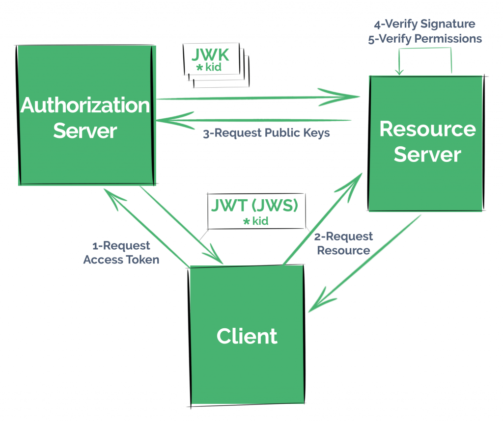
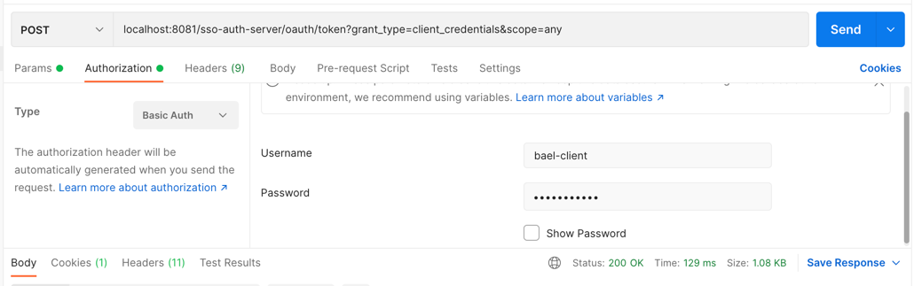

## JWS + JWK in a Spring Security OAuth2 Application

### Relevant information:

- This module uses the OAuth stack with Java 8

### Relevant Articles: 

- [JWS + JWK in a Spring Security OAuth2 Application](https://www.baeldung.com/spring-security-oauth2-jws-jwk)

curl bael-client:bael-secret\
@localhost:8081/sso-auth-server/oauth/token \
-d grant_type=client_credentials \
-d scope=any

localhost:8081/sso-auth-server/oauth/token?grant_type=client_credentials&scope=any

localhost:8082/spring-security-oauth-resource/foos/1

